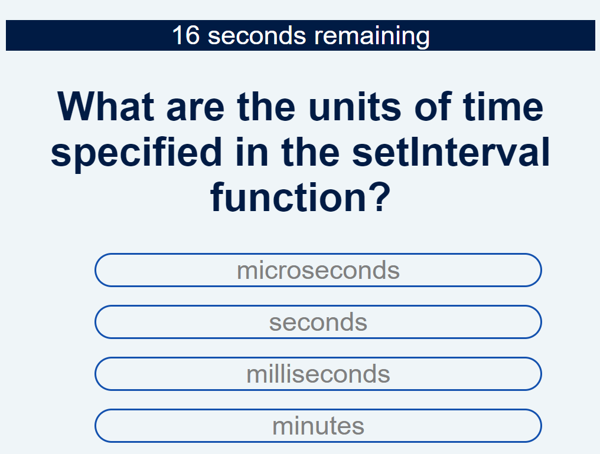
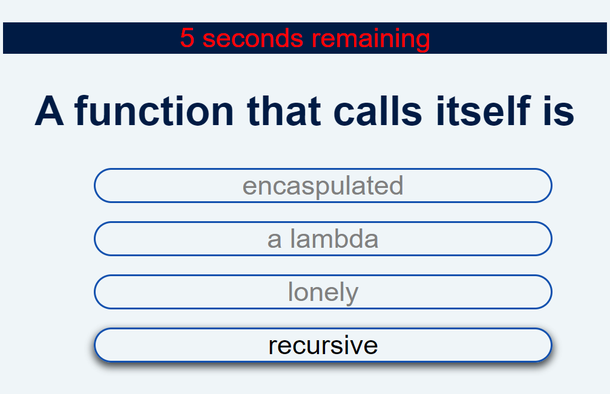
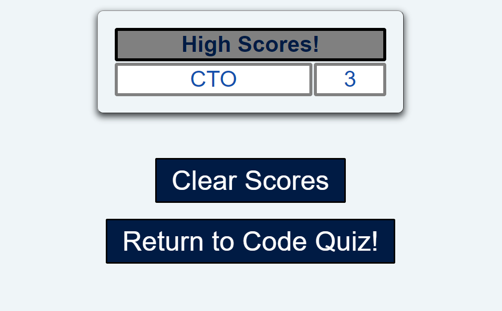

# Code Quiz (04 Web APIs Challenge)

[Live Site on Github.io](https://cokamuro.github.io/quiz-app/)

## Table of Contents
- [Description](#description)
- [Visuals](#visuals)
- [Usage](#usage)

## Description
This is the solution HTML, CSS, and JavaScript for the 02-Challenge assignment in the 04-WEB-APIs Module.

The purpose of the assignment was to create a quiz application that is timed, keeps score, and maintains a high score list.

This application runs off of an array of questions, and it dynamically adjusts to the number of answers.  The user is penalized 5 seconds for each wrong answer, and the final score is the time remaining on the clock when the questions are completed.

## Visuals
### The quiz with while running the quiz

### The quiz with time running out

### The quiz leaderboard

## Usage
This project is complete and should have no future revisions    
